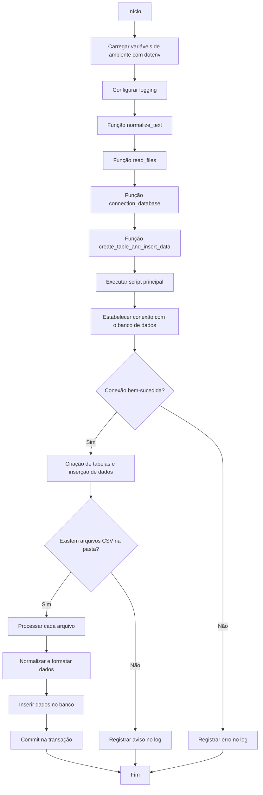

# 1. Descrição do Projeto 📋

Este projeto foi desenvolvido com o objetivo de criar uma estrutura robusta de Data Warehouse, abrangendo desde a implementação da modelagem conceitual, lógica e física. O trabalho incluiu a criação de um banco de dados transacional (OLTP) e a implementação de um pipeline ETL (Extração, Transformação e Carregamento) para integrar os dados ao Data Warehouse (DW).

O fluxo de dados foi estruturado da seguinte forma:

1. Banco de Dados Transacional (OLTP): Armazenamento inicial dos dados em uma estrutura otimizada para transações.

2. Staging Area: Um ambiente intermediário para a integração e pré-processamento dos dados extraídos.

3. Data Warehouse: Repositório final onde os dados transformados são organizados para análises.

Este projeto demonstra o processo completo de desenvolvimento de um Data Warehouse, desde a modelagem inicial até a automação de pipelines ETL, proporcionando uma base sólida para análises de dados e suporte à tomada de decisões.

# 2. Objetivo do Projeto 🎯

Desenvolver uma solução completa de Data Warehouse que integre modelagem de dados, criação de um banco transacional (OLTP) e automação de pipelines ETL, utilizando tecnologias modernas como Docker, Airbyte e Apache Airflow. O projeto visa demonstrar, na prática, o fluxo completo de dados desde a origem até a consolidação em um ambiente otimizado para análises estratégicas, com foco em escalabilidade, portabilidade e organização eficiente dos dados. Além disso, busca aplicar os conhecimentos adquiridos na formação de Engenheiro de Dados da Data Science Academy, servindo como inspiração para que outros profissionais possam utilizar esta arquitetura em seus próprios projetos, tanto pessoais quanto profissionais.

# 3. Arquitetura do Projeto 🏗️


# 4. Modelagem de Dados 🏛️

## 4.1 Modelo Conceitual (Diagrama Entidade-Relacionamento - DER)


## 4.2 Modelo Lógico


## 4.3 Modelo Dimensional


# 5. Tecnologias Utilizadas 💻

- Git
- SQL
- PostgreSQL
- MySQL
- Python
- Airbyte
- Apache Airflow
- Docker
- UML

# 6. Descrição de como as Tecnologias foram utilizadas através da ótica da Arquitetura 📝

1.  Criação do Banco de Dados Transacional (OLTP) 🏦

    - Foram gerados diversos arquivos CSV contendo os dados de entrada.
    - Um script Python foi desenvolvido para realizar o carregamento automático desses arquivos no MySQL, configurado como o banco de dados transacional (OLTP).
    - O banco OLTP foi implementado em um servidor dedicado, executado dentro de um contêiner Docker, e consistia em cerca de 30 tabelas criadas previamente através de scripts SQL executados diretamente no cliente do MySQL.

2.  Staging Area 🛠️

    - Para a staging area, foi configurado outro servidor com PostgreSQL, também rodando em um contêiner Docker independente.
    - A ferramenta Airbyte foi utilizada para estabelecer a conexão entre o banco OLTP (MySQL) e a staging area (PostgreSQL). Essa etapa foi responsável pela extração e carga inicial dos dados, garantindo a separação lógica entre os ambientes.

3.  Transformação e Carga no Data Warehouse (DW) 📊

    - O Apache Airflow foi configurado para orquestrar o pipeline de ETL, utilizando uma DAG personalizada que:

      - Extrai os dados da staging area no PostgreSQL.

      - Transforma os dados aplicando as regras de negócio necessárias.
      - Carrega os dados no Data Warehouse, que também foi implementado em PostgreSQL, mas em um servidor e contêiner Docker dedicados.

    - As tabelas do DW foram previamente criadas através de scripts SQL no cliente do PostgreSQL, garantindo que a estrutura estivesse alinhada ao modelo de dados definido para o projeto.

4.  Automatização e Integração 🔄

    - Todo o processo de ETL foi automatizado, permitindo a execução contínua e eficiente do fluxo de dados entre os diferentes ambientes.

Este projeto não apenas simula uma arquitetura real de Data Warehouse como também aplica conceitos fundamentais de engenharia de dados e automação de pipelines. 🐍🐘⚙️

# 7. Descrição de como as Tecnologias foram utilizadas através da ótica das Ferramentas 📝

1. <strong> 🐍 Python </strong>

   O Python foi utilizado para desenvolver scripts que automatizam o carregamento dos dados no MySQL, que funcionou como banco de dados transacional (OLTP) com cerca de 30 tabelas. Os arquivos CSV gerados foram processados e carregados via scripts Python, que atuaram como a ponte entre os dados e o banco de dados, garantindo que as informações fossem corretamente inseridas nas tabelas do MySQL. Além disso, o Python também foi utilizado para criar a DAG (Directed Acyclic Graph) no Apache Airflow, orquestrando o fluxo de trabalho do processo de ETL.

2. <strong> 🐳 Docker Desktop </strong>

   O Docker Desktop foi utilizado para criar contêineres isolados e garantir que cada serviço funcionasse em um ambiente controlado e separado. Criei um contêiner com o MySQL, que foi responsável pelo banco de dados transacional (OLTP), e um contêiner separado com o PostgreSQL para simular a staging area. Além disso, o PostgreSQL foi utilizado no Data Warehouse (DW), que também foi configurado dentro de um contêiner Docker em um servidor separado. O uso de contêineres facilitou a gestão dos serviços e a escalabilidade do projeto.

3. <strong> 🪼 Airbyte </strong>

   O Airbyte foi utilizado como ferramenta de integração de dados, conectando a fonte de dados (MySQL) à staging area (PostgreSQL). Ele foi responsável por extrair os dados do banco de dados MySQL e transferi-los para o PostgreSQL, garantindo que os dados estivessem prontos para serem processados e transformados no fluxo de ETL. O Airbyte automatizou esse processo de movimentação de dados, garantindo a consistência e a atualização das informações.

4. <strong> ☁️ Apache Airflow </strong>

   O Apache Airflow foi a plataforma escolhida para orquestrar todo o processo de ETL. Criei uma DAG (Directed Acyclic Graph) no Airflow para automatizar o fluxo de trabalho. A DAG buscava os dados da staging area no PostgreSQL, aplicava as transformações necessárias e, em seguida, carregava os dados transformados no Data Warehouse (DW), que também estava hospedado no PostgreSQL. O Airflow garantiu que as etapas do processo de transformação e carregamento dos dados fossem executadas de forma sequencial e programada.

5. <strong> 🐬 MySQL </strong>

   O MySQL foi utilizado como o banco de dados transacional (OLTP) responsável pelo armazenamento das tabelas operacionais com cerca de 30 tabelas. O MySQL recebeu os dados de entrada, que foram carregados por meio de scripts Python. Esse banco de dados foi fundamental para o armazenamento e gerenciamento dos dados brutos, que depois seriam processados e transformados para análises posteriores.

6. <strong> 🐘 PostgreSQL </strong>

   O PostgreSQL foi utilizado de duas maneiras: como a staging area e como o banco de dados do Data Warehouse (DW). Na staging area, o PostgreSQL recebeu os dados extraídos do MySQL via Airbyte, e no Data Warehouse, o PostgreSQL foi utilizado para armazenar os dados transformados, permitindo consultas analíticas e a geração de insights de forma eficiente. Antes do processo de ETL começar, as tabelas foram criadas no PostgreSQL com scripts SQL, que definiram a estrutura do banco de dados.

# 8. Exibição do Projeto 👁️

## 8.1 Contêineres Docker


## 8.2 Banco de Dados Transacional no MySQL

### 8.2.1 Tabelas do Banco de Dados


### 8.2.2 Tabela de Produtos


### 8.2.3 Tabela de Pedidos


### 8.2.4 Tabela de Endereços


## 8.3 Airbyte

### 8.3.1 Airbyte Source (Fonte de Dados)


### 8.3.2 Airbyte Destination (Destino dos Dados)


### 8.3.3 Airbyte Connections (Conexão dos Dados)


## 8.4 Área Intermediária e Banco de Dados Analítico no PostgreSQL

### 8.4.1 Servidores PostgreSQL


### 8.4.2 Servidor da Staging Area


### 8.4.3 Tabelas no Schema da Staging Area


### 8.4.4 Servidor do Data Warehouse (DW)


### 8.4.5 Tabelas no Schema do Data Warehouse


### 8.4.6 Tabela Fato Vendas


### 8.4.7 Tabela Dimensão Cliente


## 8.5 Airflow

### 8.5.1 Área de DAGS


### 8.5.2 Fluxo da DAG


# 9. Instalação e Configuração 🔗

- Pré-requisitos:

  1. Baixar e instalar o Docker Desktop;

     Link para download: https://www.docker.com/

  2. Baixar e instalar o PgAdmin (Client do PostgreSQL);

     Link para download: https://www.pgadmin.org/download/

  3. Baixar e instalar o Workbench (Client do MySQL);

     Link para download: https://dev.mysql.com/downloads/workbench/

  4. Baixar e instalar o Airbyte;

     Link para download: https://docs.airbyte.com/using-airbyte/getting-started/oss-quickstart

  5. Baixar e instalar o Git;

     Link para download: https://git-scm.com/downloads

<br>

- Passo a passo:

1. Primeira coisa que precisamos fazer é instalar o python. Para isso, vamos utilizar o Pyenv que é um pacote que permite gerenciar diversas versões do Python na mesma máquina.

```bash
git clone https://github.com/pyenv-win/pyenv-win.git %USERPROFILE%\.pyenv
```

2. Após executar o comando acima, será criada uma pasta no seu usuário chamada .pyenv, que conterá todos os arquivos necessários para que o Pyenv possa funcionar. Agora, precisamos configurar variáveis de ambiente para que o sistema operacional consiga compreender os comandos do Pyenv no prompt de comando. Vá até a lupa de pesquisa e procure por "configurações avançadas do sistema". Em seguida, clique em "Variáveis de ambiente" e posteriormente clique em "Novo" na parte de variáveis do usuário. Após isso, abrirá uma janela para incluir o nome e o valor da variável de ambiente que está logo abaixo.

```bash
PYENV=C:\Users\seu_usuario\.pyenv\pyenv-win\
PYENV_HOME=C:\Users\seu_usuario\.pyenv\pyenv-win\
PYENV_ROOT=C:\Users\seu_usuario\.pyenv\pyenv-win\
```

3. Para ter certeza que o Pyenv está instalado e funcionando corretamente, abra o prompt de comando e digite:

```bash
pyenv --version
```

4. Se após a execução do código acima retornar a versão do Pyenv é porque o sistema operacional já está conseguindo compreender os comandos. Caso contrário, revise o passo a passo descrito e se for necessário busque ajuda no Google. Por conseguinte, agora com as configurações necessárias, precisamos instalar o Python através do Pyenv.

```bash
pyenv install 3.12.1
```

5. Com o Python instalado, precisamos agora clonar o projeto. Caso queira manter o projeto em uma pasta específica, você pode navegar através da estrutura de pastas do seu notebook/computador com o comando "cd nome_pasta". Se não especificar a pasta, provavelmente o projeto será criado na sua pasta de usuário.Feito isso, digite:

```bash
git clone https://github.com/Kjonnathas/DataWarehouse_MySQL_Airflow.git
```

6. Com o projeto clonado, precisamos especificar a versão do python que irá rodar no projeto. Para isso, execute o seguinte comando dentro da pasta do projeto:

```bash
pyenv local 3.12.1
```

7. Em seguida, vamos criar nosso ambiente virtual. O ambiente virtual é uma boa prática que visa manter um ambiente único para cada projeto desenvolvido. Sendo assim, execute o comando:

```bash
python -m venv .venv
```

8. Agora precisamos ativar o ambiente virtual. Para isso, execute:

```bash
Set-ExecutionPolicy RemoteSigned -Scope CurrentUser

.venv/Scripts/Activate.ps1
```

9. Depois de ter feito o passo anterior, é preciso agora realizar a instalação das bibliotecas que são utilizadas no projeto. Portanto, dentro da pasta "DataWarehouse_MySQL_Airflow", use o seguinte comando:

```bash
pip install -r requirements.txt
```

10. Nesse momento, podemos começar a criação do contéiner que rodará o servidor do nosso banco de dados transacional via Docker. Abra o Docker Desktop. Em seguida, abra o prompt de comando caso ainda não esteja aberto ou tenha fechado e execute:

```bash
docker pull mysql:8.0-debian
```

11. O passo acima fará o download da imagem do MySQL do Docker Hub. Agora, com o download feito, podemos criar o contéiner. Depois de executar o comando abaixo, abra o Docker Desktop e veja se o contéiner foi criado.

```bash
docker run --name mysql_prod -p 3307:3306 -e MYSQL_ROOT_PASSWORD=escolha_uma_senha -d mysql:8.0-debian
```

12. Vamos aproveitar e criar logo também o servidor que usaremos para armazenar a nossa staging area. Após executar, faça o mesmo check no Docker Desktop para averiguar se o contéiner foi criado direitinho.

```bash
docker run --name postgres_stg --network bridge -p 5433:5432 -e POSTGRES_DB=escolha_nome_do_banco -e POSTGRES_USER=escolha_nome_do_usuario -e POSTGRES_PASSWORD=escolha_uma_senha -d postgres
```

13. Com o servidor do banco de dados transacional e da staging area criada, podemos avançar na criação das tabelas no banco de dados transacional. Porém, antes de criar as tabelas, precisamos configurar o servidor. Para isso, abra o Workbench (Client do MySQL). Após abrir, clique no botão de "+" ao lado de "MySQL Connections". Com isso, abrirá uma janela para inserir as configurações. Insira um nome para a conexão (da sua escolha), o host - para descobrir o host você pode executar o seguinte comando no prompt de comando "docker inspect mysql_prod". Irá abrir uma estrutura de json e vá até o final e procure por "IPAddress". O valor desse campo é o host da máquina -, a porta (3307) e a senha. Depois disso teste a conexão e veja se deu certo. Se der certo, basta clicar sobre a conexão que irá direcioná-lo para a tela principal do client.

14. Depois de ter feito o passo anterior, vá até o arquivo "database_transacional.sql" que está dentro da pasta "models" que está dentro da pasta "src" e copie todo o conteúdo. Copiado o conteúdo, volte ao Workbench e cole. Depois selecione todo o conteúdo colado e execute (CTRL + Enter ou clique no botão de run). Em seguida, faça um refresh e veja se o banco de dados e as tabelas foram criadas normalmente.

15. Agora que temos o banco de dados e as tabelas criadas, vamos precisar executar um script Python para popular as tabelas que estarão simulando nosso ambiente transacional. Procure pelo script "job_etl.py" dentro da pasta "jobs" que está dentro da pasta "src". Navegue até esta pasta através do seu terminal. Você pode fazer isso usando o seguinte comando:

```bash
cd src/jobs
```

16. Antes de executarmos o script Python, precisamos criar um arquivo ".env" para armazenar algumas variáveis de ambiente. Sem elas, o script resultará em erro. Portanto, crie este arquivo dentro da pasta "DataWarehouse_MySQL_Airflow" e insira as seguintes informações:

    - MYSQL_USER=root
    - MYSQL_PASSWORD=sua_senha
    - MYSQL_DB=seu_banco_de_dados
    - MYSQL_HOST=seu_host
    - MYSQL_PORT=3307
    - FOLDER_PATH=insira_o_caminho_completo_da_pasta_data
    - FOLDER_LOGS=insira_o_caminho_completo_da_pasta_logs

17. Depois de ter entrado na pasta jobs e configurado o arquivo ".env", basta apenas executar o código Python para que ele possa ler os arquivos csv e depois carregá-los no banco de dados. Para isso, digite no seu terminal:

```bash
python job_etl.py
```

Fluxo do script "job_etl.py"



18. No banco de dados da staging, a única coisa que precisa ser feita neste momento é a criação do schema. Mas antes de criar o schema, precisamos registrar o servidor. Sendo assim, clique em "Servers" com o botão direito e em seguida em "Register" e "Server...". Forneça um nome para o seu servidor da staging area. Após isso, vá até a aba de "Connection" e configure o "Host name/address" com o endereço IP da máquina ou tente com o nome do contéiner, inclua a porta (5433), em "Maintenance database" coloque o nome do banco de dados e, por fim, insira o nome de usuário no campo "Username". Após essas configurações, clique em save e seu servidor já deve estar registrado. Para a criação do schema, você pode tanto criar manualmente quanto via código. Manualmente, bastá ir até o objeto "Schemas" dentro da hierarquia do banco de dados e clicar com o botão direito escolhendo a opção "Create" e em seguida "Schema...". Com isso, abrirá uma janela onde você incluirá o nome do Schema na caixa de texto da opção "Name" e posteriormente clique em "Save". Com isso, o seu schema será criado. Caso prefira a opção via código SQL, apenas abra o query tool clicando novamente sobre o objeto Schema e em "Query Tool" e digite "CREATE SCHEMA nome_do_schema" e execute apertando a tecla F5 ou no botão de run e o schema será criado da mesma forma.

19. Se o passo anterior deu certo, podemos avançar na criação do contéiner do Airbyte e suas configurações. Aqui é importante que você já tenha feito o download do arquivo que é disponibilizado pelo Airbyte na própria documentação. O arquivo será baixado em uma pasta zipada, portanto, faça a descompactação da pasta após o download ter sido concluído. Feito isso, precisamos adicionar uma variável de ambiente para que o sistema operacional reconheça os comandos do Airbyte. Para isso, vá até suas variáveis de ambiente (explicado mais acima como se chega) e procure pela variável de ambiente "Path" na parte de variáveis de ambiente de usuário. Depois que encontrar, clique sobre ela e em seguida em "Editar". Após isso, abrirá uma janela com todas os caminhos associados ao "Path". O que você precisa fazer é pegar o caminho completo da pasta do Airbyte e adicionar na última linha disponível. Depois que o fizer, apenas clique em "Ok" e saia da tela de variáveis de ambiente. Caso esteja com o prompt de comando aberto, feche-o e abra novamente.

20. Depois dessas configurações, execute o comando abaixo para virmos se o sistema operacional já está reconhecendo os comandos do Airbyte.

```bash
abctl version
```

21. Caso o prompt de comando retorne a versão do Airbyte significa que está tudo certo e podemos prosseguir para a próxima etapa, que é criação do contéiner do Airbyte. Para isso, precisa estar com o Docker Desktop aberto. Com ele aberto, vá até o seu prompt de comando e digite:

```bash
abctl local install
```

22. Essa etapa costuma demorar pela primeira vez, então tenha paciência! É importante verificar na documentação a exigência mínima de hardware, pois o Airbyte é pesado e consome bastante memória. Se seu computador não for muito bom, é provável que vá ter problemas com travamento.

23. Após a instalação ter sido concluída com sucesso, você pode abrir seu Docker Desktop e verificar se o contéiner do Airbyte foi criado com sucesso. Caso tenha sido, digite o comando abaixo:

```bash
abctl local credentials
```

24. O comando acima lhe dará um ID e uma senha, que serão necessários para logar no Airbyte via navegador. Teste a sua conexão indo até o navegador e acessando "localhost:8000". Insira suas credenciais e o Airbyte lhe levará para a tela principal da plataforma.

25. Com o contéiner do Airbyte criado precisamos fazer uma configuração de rede para que ele consiga se comunicar com os outros contéineres criados anteriormente (do postgresql e do mysql). Se você retornar na etapa que criamos esses outros dois conténeires notará que passamos um parâmetro chamado "--network" e esse parâmetro é responsável por dizer em qual rede o contéiner estará localizado. Portanto, vamos fazer o mesmo agora para o Airbyte. Siga os comandos abaixo em sequência. Substituia <rede_atual> pela rede que Airbyte está e também substitua <container_name> pelo nome do contéiner que certamente deve ser "airbyte-abctl-control-plane". O primeiro comando mostrará a você a rede do contéiner. O nome da rede está antes dos dois pontos e dentro do par de colchetes. Se você copiar todo o resultado e substituir em <rede_atual> resultará em erro. Portanto, pegue exatamente a parte que eu descrevi.

```bash
docker inspect -f '{{.NetworkSettings.Networks}}' <container_name>

docker network disconnect <rede_atual> <container_name>

docker network connect bridge <container_name>
```

26. Com o ambiente do Airbyte agora configurado, precisamos apenas criar a source, o destination e a connection para que a ETL seja capaz de extrair os dados do servidor de produção e levá-los ao ambiente da staging area. No painel lateral esquerdo, clique em "Sources". Em seguida, clique em "New source". Na caixa de buscas, procure por "mysql" e clique sobre o conector do MySQL. Agora, aparecerá uma série de configurações que precisam ser feitas:

    a. Em "Source name" dê um nome para a sua fonte de dados;

    b. Em "Host" você precisa incluir o endereço IP da máquina do contéiner, usando o comando "docker inspect <container_name>" você consegue encontrar na parte final da estrutura json que é retornada. Adicionalmente, você pode testar se o nome do contéiner também funciona nessa etapa;

    c. Em "Port" você precisa colocar a porta mapeada pro contéiner. Como a comunicação são entre conténeires, ou seja, uma comunicação apenas no mundo interno, você irá colocar a porta 3306;

    d. Em "Database" precisamos colocar o nome do banco de dados e caso você não tenha alterado, o nome será "db_prod". Não coloque as aspas;

    d. Em "Username" você vai pôr "root". Novamente não inclua as aspas;

    e. Em "Password" inclua a senha que foi definida durante a criação do contéiner;

    f. Em "SSL modes" escolha a opção "preferred";

    g. Em "Update Method" escolha a opção "Scan Changes with User Defined Cursor";

    h. Em "SSH Tunnel Method" escolha a opção "No Tunnel".

Feita todas as configurações clique em "Test and save". Se o teste concluir sem qualquer erro a source está criada.

27. Agora vamos criar e configurar a etapa de Destination. Para isso, clique em "Destinations" no menu lateral esquerdo. Em seguida clique em "New destination". No campo de pesquisa procure por "postgres" e clique no conector. Novamente aparecerá uma série de configurações que precisam ser realizadas:

    a. Em "Destination name" escolha um nome para o seu destino;

    b. Em "Host" você seguirá a mesma explicação que foi dada na etapa de configuração da Source. Aqui, obviamente, o host será diferente, tanto se você optar pelo endereço IP quanto através do nome do contéiner;

    c. Em "Port" você colocará a porta 5432;

    d. Em "DB Name" terá que incluir o nome do banco de dados que você escolheu no momento de criar o contéiner do postgresql;

    e. Em "Default Schema" apague o schema public que vem por padrão e inclua o schema que foi criado;

    f. Em "User" você indicará o nome do usuário;

    g. Em "SSL modes" escolherá a opção "disable";

    h. Em "SSH Tunnel Method" escolherá a opção "No Tunnel";

    i. Em "Password" você definirá a senha escolhida no momento de criação do contéiner.

Feita todas as configurações clique em "Test and save". Se o teste concluir sem qualquer erro a destination está criada.

28. Por fim, vamos criar a nossa connection. Para isso, vá até o menu lateral esquerdo e clique sobre "Connections". Posteriormente clique em "New connection". Nesse momento, o Airbyte apresentará as sources que você tem configurada. Então, escolha a source que criamos anteriormente. Em seguida, precisamos definir qual será a destination. Similarmente a etapa anterior, basta escolher a destination que criamos e seguir em frente. Com isso, o Airbyte fará o carregamento e nos dará a opção de escolher os "streams", que nada mais são do que as tabelas do banco de dados. Selecione todas as tabelas e na parte de "Sync mode" escolha a opção "Full refresh | Overwrite + Deduped". Na aba de "Settings" apenas defina o nome da connection e em "schedule type" defina como "Manual". Depois, basta habilitar a connection na parte superior direita e executar o processo clicando em "Sync now".

29. Se a etapa anterior funcionar, vamos seguir em frente para criação do servidor do Data Warehouse, criação das tabelas do DW e ajuste e configuração do Airflow para fazer o orquestramento do nosso pipeline de dados.

30. Sendo assim, vamos agora executar o comando que fará a criação do nosso servidor do DW.

```bash
docker run --name postgres_dw --network bridge -p 5434:5432 -e POSTGRES_DB=db_dw -e POSTGRES_USER=data_warehouse -e POSTGRES_PASSWORD=dw_123 -d postgres
```

31. Logo após a execução do passo anterior, faça aquele check no Docker Desktop para verificar se o contéiner foi criado sem problemas.

32. Em seguida nós vamos precisar baixar o arquivo docker compose do Airflow. Normalmente, antes de fazer o download deste arquivo costumamos criar uma pasta na raiz do projeto chamada "airflow", que conterá além do próprio arquivo docker compose, alguns outros arquivos e pastas que são necessárias para que a ferramenta funcione da maneira adequada. Como inicialmente você clonou o projeto, essa pasta já está criada, isto é, não é necessário criá-la agora. Tendo isso em vista, navegue até entrar dentro do diretório da pasta "airflow". Depois que estiver dentro dela, execute o comando abaixo:

```bash
curl -LfO 'https://airflow.apache.org/docs/apache-airflow/2.10.3/docker-compose.yaml'
```

Obs.: O comando curl é um comando do Linux, portanto, caso você seu sistema operacional seja Windows, você tem duas opções: Copiar e colar este link no seu navegador e assim que o fizer seu computador/notebook fará do download do arquivo ou você pode abrir o terminal do Git que funciona com comandos Linux. Caso queira optar por essa segunda opção, vá até seu pesquisador e digite "git bash" e em seguida abra-o. Feito isso, navegue até o diretório da pasta "airflow" e execute o comando acima, que funcionará normalmente.

33. Ainda dentro do diretório do "airflow" precisamos criar algumas pastas que são padrão da ferramenta e está na documentação. Portanto, faça o seguinte:

```bash
mkdir -p ./logs ./plugins ./config
echo -e "AIRFLOW_UID=$(id -u)" > .env
```

Obs.: Se por acaso o arquivo ".env" não for criado na pasta, faça a criação de forma manual, abrindo um editor de texto e incluindo dentro dele "AIRFLOW_UID=50000" e o salve exatamente como ".env".

34. Na sequência, vamos executar um comando que fará a parte de incialização do banco de dados do Airflow.

<strong> Obs.: Antes de prosseguir, vá até a etapa 39 e faça ela primeiro. Caso você não faça a etapa 39 antes de prosseguir, você terá que refazer todas essas etapas novamente, pois será necessário deletar a stack do airflow e criá-la novamente para que a configuração do arquivo docker-compose seja válida. Então vá até lá, faça a etapa e depois volte aqui para prosseguir. </strong>

```bash
docker compose up airflow-init
```

35. Após isso, vamos agora inicializar a stack de conténeires do Airflow, executando o seguinte comando:

```bash
docker compose up
```

36. Neste momento é esperado que a stack de conténeires do airflow esteja em pleno funcionamento no Docker Desktop, portanto, vá até lá e faça essa verificação. Se preferir você também pode abrir seu terminal - que já deve estar aberto - e executar o comando "docker ps" que irá listar todos os contéineres em execução.

37. Se tudo estiver corretamente configurado, agora nos falta fazer a configuração de rede, pois o Airflow, por padrão, cria sua própria rede no Docker, chamada de "airflow_default". No entanto, lembre que nossos servidores e nossa plataforma de ETL do Airbyte estão na rede "bridge". Para que possamos fazer a comunicação entre eles, vamos ter que migrar os contéineres do Airflow para esta outra rede. Sendo assim, execute os seguintes comandos:

```bash
docker network disconnect airflow_default airflow-postgres-1

docker network disconnect airflow_default airflow-redis-1

docker network disconnect airflow_default airflow-airflow-init-1

docker network disconnect airflow_default airflow-airflow-scheduler-1

docker network disconnect airflow_default airflow-airflow-webserver-1

docker network disconnect airflow_default airflow-airflow-worker-1

docker network disconnect airflow_default airflow-airflow-triggerer-1

docker network connect bridge airflow-postgres-1

docker network connect bridge airflow-redis-1

docker network connect bridge airflow-airflow-init-1

docker network connect bridge airflow-airflow-scheduler-1

docker network connect bridge airflow-airflow-webserver-1

docker network connect bridge airflow-airflow-worker-1

docker network connect bridge airflow-airflow-triggerer-1
```

38. A série de comandos acima fará a desconexão da rede atual e em seguida conectará na rede correta. Com isso, a parte de rede está corretamente configurada e podemos avançar nas próximas configurações. Neste momento, vamos entrar dentro do contéiner webserver do Airflow para ajustar algumas configurações padrão. Para isso, vamos precisar instalar o pacote vim do Linux que permitirá abrir e editar arquivos presentes dentro do contéiner. Siga os passos abaixo:

    a. No prompt de comando execute o comando, execute:

    ```bash
    docker exec -it -u root airflow-airflow-webserver-1 bash
    ```

    Por padrão o Airflow sempre abre com o usuário default que não possui certos privilégios e um deles é que não pode fazer instalação de pacotes. Como precisamos instalar o pacote vim, o comando acima permite a gente entrar no contéiner através do usuário root que possui esse tipo de privilégio.

    b. Agora, execute os comandos na sequência:

    ```bash
    apt-get update

    apt-get install vim

    exit
    ```

    c. Vá até o Docker Desktop;

    b. Procure pelo contéiner airflow-webserver-1 dentro da stack do "airflow";

    c. Clique nos três pontinhos e depois em "open in terminal";

    d. Assim que o terminal abrir, digite:

    ```bash
    bash
    ```

    e. Em seguida, digite:

    ```bash
    ls -la
    ```

    O comando acima listará pastas e arquivos dentro do diretório corrente, incluindo arquivos e pastas ocultas. Neste momento, você conseguirá vir que há uma pasta chamada "config". Precisamos entrar dentro dela.

    f. Nesse sentido, vamos prosseguir com o comando abaixo:

    ```bash
    cd config
    ```

    g. Dentro da pasta "config" há um arquivo chamado "airflow.cfg". Precisamos abri-lo para manipular o valor de algumas variáveis. Dito isto, digite:

    ```bash
    vim airflow.cfg
    ```

    h. Dentro do arquivo "airflow.cfg" tome muito cuidado pois é um arquivo de configuração super importante e que pode danificar o funcionamento do seu Airflow. Faça exatamente o que está sendo dito aqui. Navegue pelo arquivo com o scroll do seu mouse e procure pela variável "expose_config" e altere seu valor para "True". Para fazer isso, clique na tecla "I" para poder editar o arquivo através do vim, após ter feito a alteração aperte em "ESC" e depois faça ":w" para salvar a alteração. Em seguida, localize a variável "smtp_host" e altere para "smtp.gmail.com" se seu e-mail for gmail. Caso seja outlook ou algum outro provedor, faça uma busca no google para descobrir qual é o smtp dele. Novamente, clique em "I" para poder alterar o arquivo. Em seguida, procure por "smtp_starttls" e coloque como "True". Caso já esteja, não precisa alterar, apenas mantenha. Agora, procure por "smtp_ssl" que deve estar logo abaixo e coloque como "False". Se já estiver, apenas mantenha. Em "smtp_user" inclua seu e-mail. Em "smtp_password" coloque sua senha. Aqui é importante estar atento que, não é possível passar sua senha de acesso diretamente. Você precisa criar uma senha de aplicativo e usá-la neste caso. Vá até o google e procure como criá-la. Após isso, retorne aqui e inclua esta senha de aplicativo. Em "smtp_port" coloque a porta "587" e em "smtp_mail_from" coloque novamente o seu e-mail. Após essas alterações, clique em "ESC" e depois faça ":w" para salvar as alterações que foram feitas. Por fim, procure pela variável "test_connection" e altere de "Disabled" para "Enabled". Essa variável é que permite realizar teste de conexão na UI (User Interface). Feito isso, faça ":wq" que irá salvar as alterações e sair do editor de texto.

39. Para fechar essa etapa árdua de configuração do Airflow, precisamos fazer dois ajustes no arquivo docker-compose.yaml que está presente dentro da pasta "airflow". Abra o arquivo e faça o seguinte:

    a. Logo abaixo da variável "AIRFLOW_CONFIG", insira as seguintes variáveis:

    - AIRFLOW_SCHEDULER_MIN_FILE_PROCESS_INTERVAL": 5
    - AIRFLOW_SCHEDULER_DAG_DIR_LIST_INTERVAL: 20
    - AIRFLOW_EMAIL_EMAIL_BACKEND: airflow.utils.email.send_email_smtp
    - AIRFLOW_SMTP_SMTP_HOST: "o smtp do seu provedor"
    - AIRFLOW_SMTP_SMTP_STARTTLS: true
    - AIRFLOW_SMTP_SMTP_SSL: false
    - AIRFLOW_SMTP_SMTP_USER: "seu e-mail"
    - AIRFLOW_SMTP_SMTP_MAIL_FROM: "seu e-mail"
    - AIRFLOW_SMTP_SMTP_PASSWORD: "sua senha de aplicativo"
    - AIRFLOW_SMTP_SMTP_PORT: "a porta de conexão"

    b. Por fim, dentro da tag "volumes", inclua a seguinte linha:

    - ${AIRFLOW_PROJ_DIR:-.}/models:/opt/airflow/models

Obs.: Após a palavra "AIRFLOW", "SCHEDULER" e o primeiro "SMTP" coloque dois underlines em vez de um como está especificado. Tentei colocar os dois underlines mas por algum motivo o arquivo não está permitindo, portanto, mantive apenas um. Mas se não fizer como estou informando, resultará em erro, então preste bastante atenção nisso.

Obs.²: Essa etapa é necessária para que o Airflow consiga enviar e-mails para você. Sem isso, o seu fluxo irá quebrar quando chegar na task que envia o e-mail de sucesso do fluxo.

40. Agora que temos o Airflow com suas configurações de rede e configurações de parametrização realizadas, vamos criar as tabelas do nosso DW (Data Warehouse). Para isso, abra o PgAdmin (Client do PostgreSQL) e registre o servidor do DW (mostrei na etapa 18 como registrar). Depois que concluir o registro do servidor, vá até o script "database_dw.sql", copie o código SQL, vá até seu servidor do DW, abra um query tool, cole o código e execute-o. Depois de fazê-lo, veja se o banco de dados, o schema e as tabelas foram criadas corretamente.

41.

# 10. Licença

Este projeto está licenciado sob os termos da licença MIT. Veja o arquivo [LICENSE](LICENSE) para mais detalhes.
